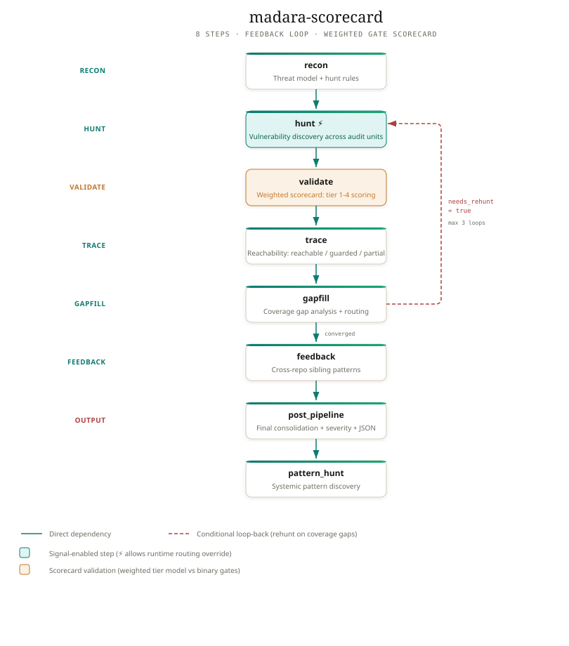
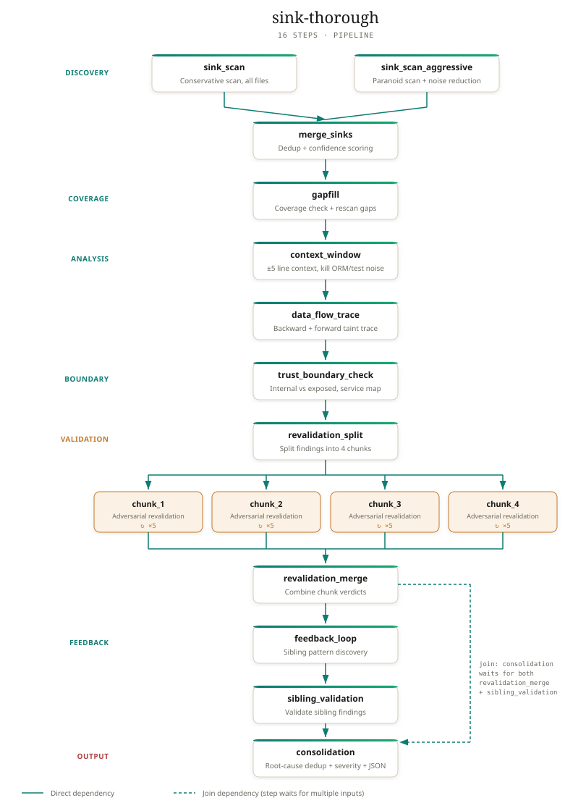

# Appendix to "Hunting Vulnerabilities Using Frontier Models" Blog Post

This appendix provides additional diagrams and references for the blog post located at [https://sec.okta.com/articles/2026/09/hunting-vulnerabilities-using-frontier-models](https://sec.okta.com/articles/2026/09/hunting-vulnerabilities-using-frontier-models).

## Pipeline Diagrams

These diagrams depict two of the pipelines we created, named “madara-scorecard” and “sink-thorough.” They demonstrate different levels of complexity in our graph-engineering approach and show how we used iterations, loops, and branching.

  

## Research References

### Orchestration & Multi-Agent Coordination

* [KubeOpenCode, kubeopencode](https://github.com/kubeopencode/kubeopencode)  
* [MCO, mco-org](https://github.com/mco-org/mco)  
* [Omnigent, omnigent-ai](https://github.com/omnigent-ai/omnigent)  
* [Paperclip, PaperclipAI](https://github.com/paperclipai/paperclip)  
* [Polos, Coeus Institute](https://github.com/CoeusInstitute/Polos)  
* [Regina \- Stateful AI Agent Orchestration on Watt, Platformatic](https://blog.platformatic.dev/introducing-regina-stateful-ai-agent-orchestration-watt)  
* [SCION, Google Cloud Platform](https://github.com/GoogleCloudPlatform/scion)  
* [Zob Harness, cgarrot](https://github.com/cgarrot/zob-harness)  
* [ActiveGraph, Yohei Nakajima](https://github.com/yoheinakajima/activegraph)  
* [HumanLayer](https://github.com/humanlayer/humanlayer)   
* [DeLM \- Decentralized Multi-Agent Systems with Shared Context](https://arxiv.org/abs/2606.10662)  
* [TRINITY: An Evolved LLM Coordinator, Sakana AI](https://arxiv.org/pdf/2512.04695)

### Scanning Pipelines & Vulnerability Research

* [Defending Code Reference Harness, Anthropic](https://github.com/anthropics/defending-code-reference-harness)  
* [Defending Code Reference Harness \- Codex Fork](https://github.com/zeroxjf/defending-code-reference-harness-codex)  
* [ai-scanner, 0din-ai](https://github.com/0din-ai/ai-scanner)  
* [patchdiff-ai, Akamai](https://github.com/akamai/patchdiff-ai)  
* [sc-auditor, Archethect](https://github.com/Archethect/sc-auditor)  
* [metis, Arm Product Security Team](https://github.com/arm/metis)  
* [Cloudflare Cyber Frontier: Project Glasswing & Mythos Preview, Cloudflare](https://blog.cloudflare.com/cyber-frontier-models/)  
* [Cloudflare Security Audit Skill, Cloudflare](https://github.com/cloudflare/security-audit-skill)  
* [DARPA AIxCC — ATLANTIS, Team Atlanta](https://github.com/Team-Atlanta/aixcc-afc-atlantis)  
* [DARPA AIxCC — Buttercup, Trail of Bits](https://github.com/trailofbits/afc-buttercup)  
* [DARPA AIxCC — ARTIPHISHELL, Shellphish](https://github.com/shellphish/artiphishell)  
* [On the Coming Industrialisation of Exploit Generation with LLMs, Sean Heelan](https://sean.heelan.io/2026/01/18/on-the-coming-industrialisation-of-exploit-generation-with-llms/)  
* [anamnesis-release, Sean Heelan](https://github.com/SeanHeelan/anamnesis-release)  
* [Datadog SAIST, Datadog](https://github.com/DataDog/datadog-saist)  
* [Needle in the Haystack: LLM Vulnerability Research Methodology, Devansh](https://devansh.bearblog.dev/needle-in-the-haystack/)  
* [audit, evilsocket](https://github.com/evilsocket/audit)  
* [OpenAnt, Knostic](https://github.com/knostic/OpenAnt)  
* [Raptor](https://github.com/gadievron/raptor)  
* [GitHub Security Lab \- seclab-taskflow](https://github.com/GitHubSecurityLab/seclab-taskflow-agent)  
* [Google AI-Assisted Vulnerability Management, Google Cloud](https://cloud.google.com/blog/topics/threat-intelligence/ai-assisted-vulnerability-management)  
* [Grimoire — Agentic Security Research Toolkit, Joran Honig](https://github.com/JoranHonig/grimoire)  
* [Scalable Research Tooling for Agent Systems, Knifecoat](https://knifecoat.com/Posts/Scalable+research+tooling+for+agent+systems)  
* [llmff, syndicalt](https://github.com/syndicalt/llmff)  
* [Exploit Brokers Pay $500,000 for a WordPress RCE I Found with GPT-5.6, SLCyber](https://slcyber.io/research-center/exploit-brokers-pay-500000-for-a-wordpress-rce-i-found-one-with-gpt5-6/)  
* [OpenAI CDC Prompt](https://cdn.openai.com/pdf/04d1d1e4-bc75-476a-97cf-49055cd98d31/cdc_prompt.pdf)  
* [OpenAI Codex Security](https://github.com/openai/codex-security)   
* [Patch Diffing Pipeline, OriginHQ](https://www.originhq.com/blog/patch-diffing-pipeline)  
* [medusa, Pantheon Security](https://github.com/Pantheon-Security/medusa)  
* [Escaping the Guest: How Custom LLM Workflows Uncovered Critical VMsvga Vulnerabilities, Cyera Research](https://www.cyera.com/research/escaping-the-guest-how-custom-llm-workflows-uncovered-critical-vmsvga-vulnerabilities)  
* [Strix](https://github.com/usestrix/strix)  
* [Agentic Malware Analysis Pipeline, Tim Blazytko](https://synthesis.to/2026/03/18/agentic_malware_analysis.html)  
* [Vulpine, Halvar Flake](https://github.com/thomasdullien/vulpine)  
* [TokenFuzz, tokenfuzz](https://github.com/tokenfuzz/tokenfuzz)  
* [Trace37 Mastermind](https://labs.trace37.com/blog/mastermind-ai-ecosystem/)  
* [DeepSec, Vercel](https://github.com/vercel-labs/deepsec)  
* [VulnHunter, Capital One](https://github.com/capitalone/vulnhunter)  
* [Bullying LLMs into Submission to Find 0-Days at Scale, Andy Gill](https://blog.zsec.uk/bullyingllms/)  
* [Harness Kit, ZephrFish](https://github.com/ZephrFish/harness-kit)  
* [Visa Vulnerability Agentic Harness, Visa](https://github.com/visa/visa-vulnerability-agentic-harness)  
* [https://www.figma.com/blog/how-figma-stays-ahead-of-vulnerabilities-with-agents/](https://www.figma.com/blog/how-figma-stays-ahead-of-vulnerabilities-with-agents/)  
* [https://blog.cloudflare.com/build-your-own-vulnerability-harness/](https://blog.cloudflare.com/build-your-own-vulnerability-harness/)  
* [https://blog.trailofbits.com/2026/07/28/how-we-use-goal-to-find-bugs-in-patch-the-planet/](https://blog.trailofbits.com/2026/07/28/how-we-use-goal-to-find-bugs-in-patch-the-planet/)   
* [https://workos.com/blog/vulnerability-analysis-pipeline](https://workos.com/blog/vulnerability-analysis-pipeline)

### Sandboxing Architecture

* [nono](https://github.com/nolabs-ai/nono)  
* [BoxLite](https://github.com/boxlite-ai/boxlite)   
* [CubeSandbox, TencentCloud](https://github.com/TencentCloud/CubeSandbox)  
* [Microsandbox, superradcompany](https://github.com/superradcompany/microsandbox)  
* [OpenSandbox, opensandbox-group](https://github.com/opensandbox-group/OpenSandbox)  
* [SmolVM, CelestoAI](https://github.com/CelestoAI/smolVM)  
* [void-box, the-void-ia](https://github.com/the-void-ia/void-box)  
* [NemoClaw, NVIDIA](https://github.com/NVIDIA/NemoClaw)   
* [Docker Sandboxes](https://www.docker.com/products/docker-sandboxes/) 

### Additional Tooling

* [arscontexta, agenticnotetaking](https://github.com/agenticnotetaking/arscontexta)  
* [Agent Vault, Infisical](https://github.com/Infisical/agent-vault)  
* [Alex, madhavajay](https://github.com/madhavajay/alex)  
* [CAI, aliasrobotics](https://github.com/aliasrobotics/cai)  
* [claude-context, Zilliz](https://github.com/zilliztech/claude-context)  
* Claude-Mem[, thedotmack](https://github.com/thedotmack/claude-mem)  
* [codex-lsp, code-yeongyu](https://github.com/code-yeongyu/codex-lsp)  
* [CocoIndex, cocoindex-io](https://github.com/cocoindex-io/cocoindex)  
* [CodeGraph, colbymchenry](https://github.com/colbymchenry/codegraph)  
* [Cortex (cx), hargabyte](https://github.com/hargabyte/cortex)  
* [evo, evo-hq](https://github.com/evo-hq/evo)  
* [Foreman, palkeo](https://github.com/palkeo/foreman)  
* [Garak, leondz](https://github.com/leondz/garak/)  
* [Gno, gmickel](https://github.com/gmickel/gno)  
* [Gortex, zzet](https://github.com/zzet/gortex)  
* [graphiti, Zep](https://github.com/getzep/graphiti)  
* [GraphTrail, escoffier-labs](https://github.com/escoffier-labs/graphtrail)  
* [Grimoire, Joran Honig](https://github.com/JoranHonig/grimoire)  
* [HouYi, LLMSecurity](https://github.com/LLMSecurity/HouYi)  
* [HyperResearch, jordan-gibbs](https://github.com/jordan-gibbs/hyperresearch)  
* [Julius, Praetorian](https://github.com/praetorian-inc/julius)  
* [lean-ctx, yvgude](https://github.com/yvgude/lean-ctx)  
* [llmcc, allenanswerzq](https://github.com/allenanswerzq/llmcc)  
* [LLM-Lens](https://github.com/LakshmiSravyaVedantham/llm-lens)  
* [LLMux, Lakshmi Sravya Vedantham](https://github.com/LakshmiSravyaVedantham/llmux)  
* [LSAP, lsp-client](https://github.com/lsp-client/LSAP)  
* [lsp-skill, lsp-client](https://github.com/lsp-client/lsp-skill)  
* [llm-sast-scanner, SunWeb3Sec](https://github.com/SunWeb3Sec/llm-sast-scanner)  
* [mcp-security-hub, FuzzingLabs](https://github.com/FuzzingLabs/mcp-security-hub)  
* [Kitaru](https://github.com/zenml-io/kitaru)   
* [operant-mcp, operantlabs](https://github.com/operantlabs/operant-mcp)  
* [osgrep, Ryandonofrio3](https://github.com/Ryandonofrio3/osgrep)  
* [pentest-ai-agents, 0xSteph](https://github.com/0xSteph/pentest-ai-agents)  
* [PentestGPT, GreyDGL](https://github.com/GreyDGL/PentestGPT)  
* [Pipelock, luckyPipewrench](https://github.com/luckyPipewrench/pipelock)  
* [Plannotator, backnotprop](https://github.com/backnotprop/plannotator)  
* [Promptfoo, promptfoo](https://github.com/promptfoo/promptfoo)  
* [semtools, run-llama](https://github.com/run-llama/semtools)  
* [semantica, Hawksight AI](https://github.com/Hawksight-AI/semantica)  
* [Sentry Security Review Skill, Sentry](https://github.com/getsentry/skills)  
* [Serena, oraios](https://github.com/oraios/serena)  
* [Spikee, WithSecure](https://github.com/WithSecureLabs/spikee)  
* [Trail of Bits Skills, Trail of Bits](https://github.com/trailofbits/skills)  
* [Trailmark, Trail of Bits](https://github.com/trailofbits/trailmark)  
* [Whistleblower, Repello-AI](https://github.com/Repello-AI/whistleblower)  
* [Zaxy, syndicalt](https://github.com/syndicalt/zaxy)  
* [Memsearch, Zilliztech](https://github.com/zilliztech/memsearch)

### Analytics, Telemetry & Cost Tracking

* [AgentSight, eunomia-bpf](https://github.com/eunomia-bpf/agentsight)  
* [AgentTrace, luoyuctl](https://github.com/luoyuctl/agenttrace)  
* [Agent Lens, dreadnode](https://github.com/dreadnode/agent-lens)  
* [Agent Sessions, jazzyalex](https://github.com/jazzyalex/agent-sessions)  
* [AgentsView, kenn-io](https://github.com/kenn-io/agentsview)  
* [Codeburn, getagentseal](https://github.com/getagentseal/codeburn)  
* [LiteLLM, BerriAI](https://github.com/BerriAI/litellm)  
* [MLflow](https://github.com/mlflow/mlflow)  
* [OpenTelemetry Collector, OpenTelemetry](https://github.com/open-telemetry/opentelemetry-collector)  
* [Rudel, obsessiondb](https://github.com/obsessiondb/rudel)  
* [Spool, spool-lab](https://github.com/spool-lab/spool)  
* [Tokscale, junhoyeo](https://github.com/junhoyeo/tokscale)  
* [TokenTop, tokentopapp](https://github.com/tokentopapp/tokentop)  
* [Vibe-Replay, tuo-lei](https://github.com/tuo-lei/vibe-replay)
